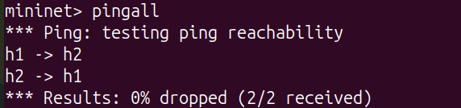
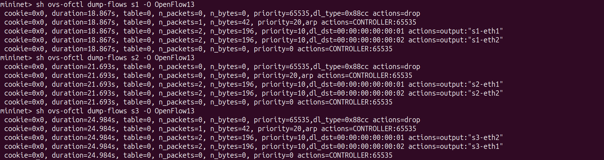
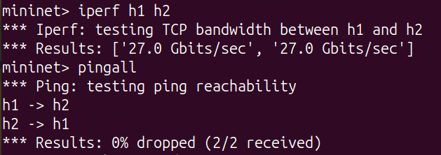
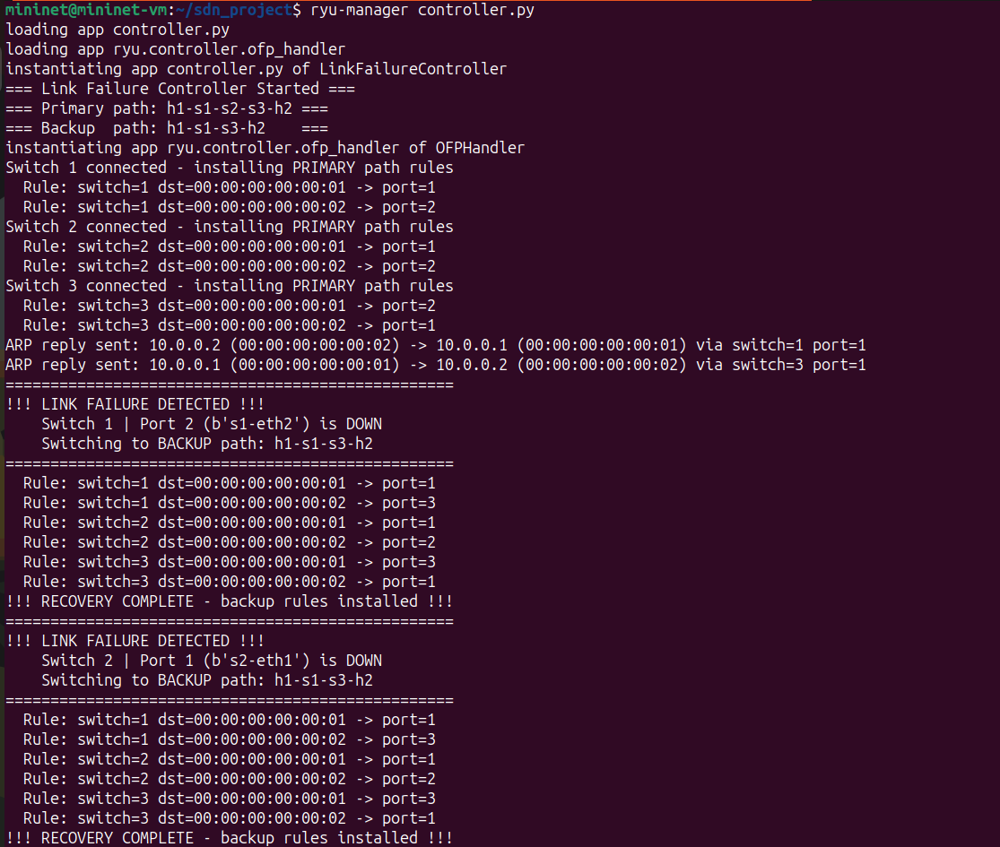
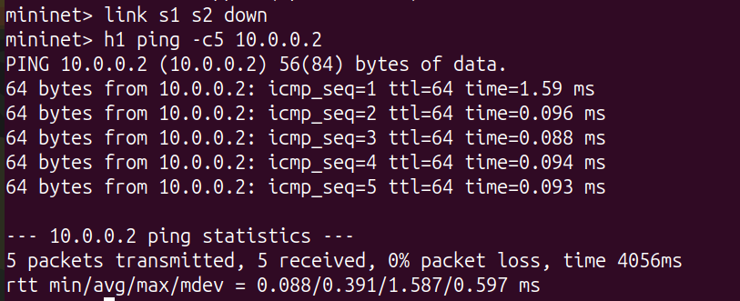
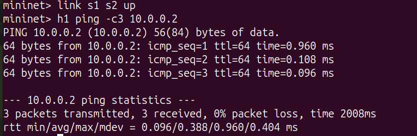
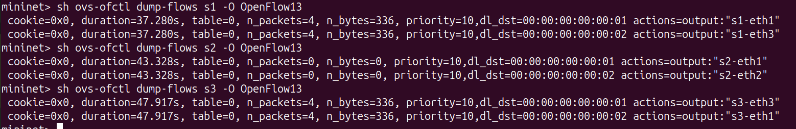

# SDN Link Failure Detection and Recovery Project

**NAME:** Ayushman Dey

**SRN:** PES2UG24CS102

**Institution:** PES University

**Course:** Computer Networks - UE24CS252B

---

## Problem Statement

In traditional networks, link failure recovery relies on distributed protocols like STP or OSPF which can take 30+ seconds to converge. This project demonstrates how Software-Defined Networking (SDN) solves this by centralizing routing decisions in a controller that can detect failures instantly and push updated flow rules to switches in milliseconds.

**Objective:** Implement an SDN controller using Ryu and Mininet that:
- Forwards traffic along a primary path under normal conditions
- Detects link failures via OpenFlow PortStatus messages
- Dynamically installs backup flow rules to restore connectivity
- Demonstrates recovery with 0% packet loss

---

## Topology

```
h1 (10.0.0.1)
     |
     s1 -------- s2
     |             |
     +---- s3 ----+
           |
      h2 (10.0.0.2)
```

**Switches:** s1, s2, s3 (Open vSwitch, OpenFlow 1.3)  
**Hosts:** h1 (MAC: 00:00:00:00:00:01), h2 (MAC: 00:00:00:00:00:02)  
**Primary path:** h1 → s1 → s2 → s3 → h2  
**Backup path:** h1 → s1 → s3 → h2

**Verified port mapping:**
- s1: port1=h1, port2=s2, port3=s3
- s2: port1=s1, port2=s3
- s3: port1=h2, port2=s2, port3=s1

---

## SDN Concepts Demonstrated

- **Controller-Switch Interaction:** Ryu connects to OVS switches via OpenFlow 1.3
- **Proactive Flow Installation:** Controller pushes match-action rules to all switches on startup
- **ARP Proxying:** Controller intercepts ARP requests and replies directly, preventing broadcast storms in the triangle topology
- **PacketIn Handling:** Unmatched packets sent to controller for processing
- **PortStatus Events:** Controller listens for OFPPR_DELETE/OFPPR_MODIFY to detect link failures
- **Dynamic Rerouting:** On failure, controller flushes flows and installs backup path rules across all switches

---

## Setup and Execution

### Requirements

- Ubuntu 20.04 or Mininet VM
- Mininet 2.3.0
- Open vSwitch
- Ryu SDN Framework 4.34
- Python 3.8

### Installation

```bash
sudo apt install mininet -y
sudo apt install python3-pip -y
sudo pip3 install ryu
sudo pip3 install eventlet==0.30.2
```

### Running

**Terminal 1 - Start the controller:**
```bash
ryu-manager controller.py
```

**Terminal 2 - Start the topology:**
```bash
sudo python3 topology.py
```

---

## Test Scenarios

### Scenario 1: Normal Forwarding

```bash
mininet> pingall
mininet> iperf h1 h2
mininet> sh ovs-ofctl dump-flows s1 -O OpenFlow13
```

Expected output:
```
*** Results: 0% dropped (2/2 received)
*** Results: ['27.0 Gbits/sec', '27.0 Gbits/sec']
```

### Scenario 2: Link Failure and Recovery

```bash
mininet> link s1 s2 down
mininet> h1 ping -c5 10.0.0.2
mininet> sh ovs-ofctl dump-flows s1 -O OpenFlow13
```

Expected Ryu controller output:
```
==================================================
!!! LINK FAILURE DETECTED !!!
    Switch 1 | Port 2 (s1-eth2) is DOWN
    Switching to BACKUP path: h1-s1-s3-h2
==================================================
  Rule: switch=1 dst=00:00:00:00:00:02 -> port=3
  Rule: switch=3 dst=00:00:00:00:00:01 -> port=3
!!! RECOVERY COMPLETE - backup rules installed !!!
```

Expected ping output:
```
5 packets transmitted, 5 received, 0% packet loss
rtt min/avg/max/mdev = 0.090/0.432/1.666/0.617 ms
```

---

## Proof of Execution

### Scenario 1 - Normal Operation

**pingall:**



**Flow tables (primary path):**



**iperf throughput:**



### Scenario 2 - Link Failure and Recovery

**Ryu logs - failure detected:**



**Ping during recovery (0% loss):**





**Flow tables (backup path):**



---

## References

1. OpenFlow Switch Specification v1.3 — https://opennetworking.org/wp-content/uploads/2014/10/openflow-spec-v1.3.0.pdf
2. Ryu SDN Framework Documentation — https://ryu.readthedocs.io/en/latest/
3. Mininet Documentation — http://mininet.org/docs/
4. Open vSwitch Documentation — https://docs.openvswitch.org/
5. PES University Computer Networks Lab Manual — UE24CS252B